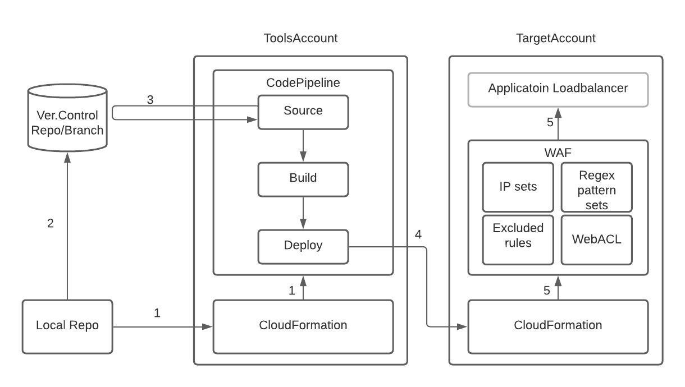

# Aligent AWS WAF stack

## Overview

This repository defines a Node module for two AWS CDK stack modules which can be included into an environment.

1. WAFPipelineStack with Cross-account deployment

    This stack configures an AWS CodePipeline application which will deploy an instance of the WAFStack based on changes to the configured repository/branch.
    There are two AWS accounts involved: ToolsAccount and TargetAccount, where we don't want the TargetAccount to access to the whole version control system, e.g. BitBucket or GitHub, as they currently can't limit the access to repository level.

    

    1. Configure a CDK project on your local, run `cdk deploy` to create a CodePipeline in ToolsAccount via CloudFormation
    2. Push the project code to the repository/branch
    3. CodePipeline Source stage picks up the change in the repository/branch and initiate the pipeline
    4. CodePipeline Deploy stage initiates Target Account Cloudformation stack creation/update
    5. TargetAccount's CloudFormation creates/configures/updates WAF resources

2. WAFStack

    If you don't need a pipeline or Cross-account deployment, just use this stack. See Step9 in the next section for further information.

## How to use: Creating a new WAFPipelineStack project

> **_NOTE:_** npm ver.7 will cause an issue a later stage hence ver.6 is required until this issue is resolved: https://github.com/npm/cli/issues/2610

Install cdk first (`npm install -g aws-cdk`, or [this instruction](https://docs.aws.amazon.com/cdk/latest/guide/getting_started.html)) and follow the steps described below.

1. In order to have AWS ToolsAccount be able to talk to the version control system, create *CodeStar Connection*. This is a one-off task between the two, though, hence reusable across multiple projects. [Connecting to BitBucket, for example](https://docs.aws.amazon.com/dtconsole/latest/userguide/connections-create-bitbucket.html)

2. Initialise a CDK project

    $ npx cdk init app --language=typescript

3. Bootstrap the TargetAccount to grant the ToolsAccount the permission to create resources. This is per-region basis.

        $ env CDK_NEW_BOOTSTRAP=1 npx cdk bootstrap \
                --profile <TargetAccountProfile> \
                --cloudformation-execution-policies arn:aws:iam::aws:policy/AdministratorAccess \
                --trust <ToolsAccountId> \
                aws://<TargetAccountId>/<region>

4. Install this node module

        $ npm install git+https://github.com/aligent/aws-cdk-waf-stack.git

    If you want to pin down to a specific version:

        $ npm install git+https://github.com/aligent/aws-cdk-waf-stack.git#<commit/tag>

5. Replace project files

    - Replace `bin/<projectName.ts>` in the project with `sample/waf.ts` of this repo
    - Replace `lib/<projectName-stack.ts>` in the project with `sample/environments.ts` of this repo

6. Update `lib/environments.ts` with the details. You need the below information

    - CodeStar Connection ARN that was created in Step 1
    - BitBucket (or other version control system) repository/branch details
    - Office and AWS NAT GW IP addresses to be allowed anytime
    - User-Agent string to bypass the AWS default BadBot rule
    - ARNs of FE Application Load Balancers this WAF rule is to be associated with

7. Update `bin/waf.ts` if needed, e.g. additional environments or stack name changes.

8. Run `npm install` and update `cdk.json`:

    - `app`: replace `<project_name.ts>` with `waf.ts`.
    - `context`: add `"@aws-cdk/core:newStyleStackSynthesis": true`

9. Rebuild `cdk.context.json` (not needed in this project/stack)

10. Test by running `npx cdk synth` and `npx cdk ls`. For further testing and customisation, refer to the **Local development** section below. By now you are going to see two stacks per each environment; one for Pipeline deployment, the other for direct deployment. See Step 12 down below.

11. Push the code to the relevant branch

12. Deploy the stack, e.g. `npx cdk deploy <target-WAF-environment> --profile <ToolsAccountProfile>` to create the CodePipeline, followed by TargetAccount WAF resource creation. 

    If you don't need a pipeline/cross-account deployment, deploy `<target-WAF-environment>/<target-WAF-environment>/stack` directly to the target account by `npx cdk deploy <StackName> --profile <TargetAccountProfile>`

## Monitor and activate
By default, WebACL this stack creates will work in COUNT mode to begin with.After a certain period of monitoring under real traffic and load, apply necessary changes, e.g. IP allow_list or rate limit, to avoid service interruptions before switching to BLOCK mode.

## Local development
[NPM link](https://docs.npmjs.com/cli/v7/commands/npm-link) can be used to develop the module locally.
1. Pull this repository locally
2. `cd` into this repository
3. run `npm link`
4. `cd` into the downstream repo (target project, etc) and run `npm link 'aws-waf-stack'`
The downstream repository should now include a symlink to this module. Allowing local changes to be tested before pushing.

